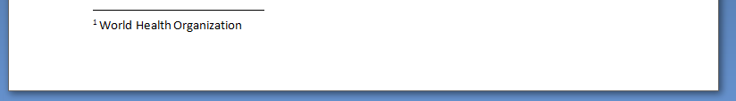

The `HtmlToOpenXml` converter supports the display of defined terms and glossaries using standard HTML tags (`<abbr>` or `<acronym>`). The parser treats these tags equivalently, generating the necessary linked targets in the final DOCX document.

## Inline Definitions

The simplest usage involves using the `title` attribute on the HTML element:

```html
<abbr title="World Health Organization">WHO</abbr> was founded in 1948.
```

The converter renders the abbreviation inline with a small jump indicator, which displays the full definition upon hover or when accessed in the DOCX document.



## Page-End Definitions

For longer references, you can define a comprehensive list of terms at the bottom of the page. This is achieved by using the `AcronymPosition` property on the converter instance:

```csharp
converter.AcronymPosition = AcronymPosition.PageEnd;
```

The converter will then render the full glossary at the end of each page, which is the appropriate method for large documents or glossaries.

## Supporting Hyperlinks and Resources

The `title` attribute can hold a full URI or path. The converter faithfully translates this into the DOCX link target, whether it is:

* `http://www.site.com` (Web URI)
* `file:///path/to/document.html` (Local, FTP or UNC network path)
* `mailto:contact@localhost` (Mail)

This guarantees that the referenced link is embedded correctly in the target metadata.
