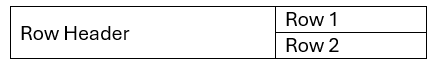
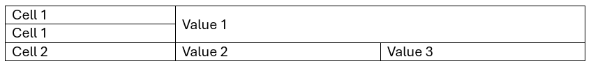
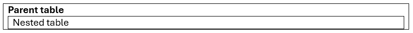
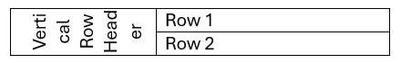
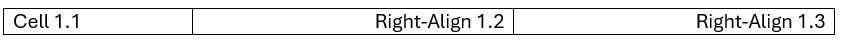
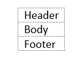

## Styles

Styles defined in the `<table>` tag are applied inside the table’s elements.
Defined width attributes in table is applied in the open xml document.
No border attribute or a `border="0"` will hide the border on the word document.

## Table Widths

Those width are supported:

| HTML Attribute | Converter Action | Meaning in DOCX |
| :--- | :--- | :--- |
| `auto` | Auto-Fit Content | Dynamically adjusts column widths to fit content. |
| `100%` or (no width) | Page-Width Default | Span the full printable page width. |
| `[value]%` | Percentage Width | Applies a percentage of the available page width. |
| `px` or `pt` | Fixed Dimension | Locks the column/cell to a specific physical size. |

**Disclaimer**: The output DOCX file is fully compliant with Open XML. Compatibility with third-party viewers (e.g., MacOS Pages) may vary when rendering complex structural elements like merged cells.

## Row Span and Column Span

```html
<table width="50%" align="center" border="1">
    <tr>
        <td rowspan="2">Row Header</td>
        <td>Row 1</td>
    </tr>
    <tr>
        <td>Row 2</td>
    </tr>
</table>
```



```html
<table width="100%" border="1">
    <tr>
        <td>Header 1</td>
        <td colspan="2">Header 2</td>
    </tr>
    <tr>
        <td>Cell 1.1</td>
        <td>cell 1.2</td>
        <td>cell 1.3</td>
    </tr>
</table>
```


ColSpan and RowSpan on the same cell

```html
<table border="1">
    <tr>
        <th>Cell 1</th>
        <th colspan="2" rowspan="2">Value 1</th>
    </tr>
    <tr>
        <td>Cell 1</td>
    </tr>
    <tr>
        <td>Cell 2</td>
        <td>Value 2</td>
        <td>Value 3</td>
    </tr>
</table>
```



## Nested table

```html
<table width="100%" border="1">
<tr>
    <td><b>Parent table</b>
        <table border="1">
            <tr>
                <td>Nested table</td>
            </tr>
        </table>
    </td>
</tr>
</table>
```



## Vertical text is supported

```html
<table width="50%" align="center" border="1">
    <tr>
        <td rowspan="2" style="writing-mode: tb-lr;">Vertical Row Header</td>
        <td>Row 1</td>
    </tr>
    <tr>
        <td>Row 2</td>
    </tr>
</table>
```



## Column Definition

`col` tag describing the styles of columns across the whole table. You may or may not place those tags inside a `colgroup` tag.

The attribute `span` is supported to copy the styles on the next columns.

```html
<table>
<col />
<col style='text-align:center' span='2' />
<tr>
    <td>Cell 1.1</td><td>Cell 1.2</td><td>Cell 1.3</td>
</tr>
</table>
```



## Logical Table Sections

Unlike the flexibility of HTML parsers, the converter enforces the logical flow required by Open XML. Therefore, regardless of the order in which you input the `<thead>`, `<tbody>`, and `<tfoot>` tags, they will always be correctly ordered in the final document body (Header → Body → Footer).

```html
<table>
    <tbody><tr><td>Body</td></tr><tbody>
    <thead><tr><td>Header</td></tr><thead>
    <tfoot><tr><td>Footer</td></tr><tfoot>
</table>
```


