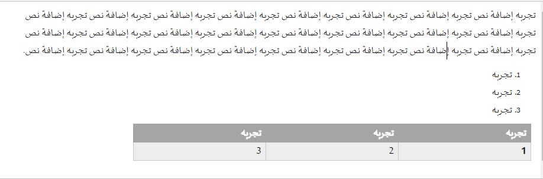

## Control the Text Flow

The converter supports applying both Left-to-Right (LTR) and Right-to-Left (RTL) layouts via two attributes: `dir` and `lang`.

**Key Distinction:**

* **`dir` Attribute:** Controls the **layout direction** (LTR or RTL). This dictates how characters flow and justifies margins.

* **`lang` Attribute:** Specifies the language, which helps determine the natural reading order and culture.

If `lang` is set to a language known to be RTL (e.g., Arabic), the converter will often infer rtl and apply it, but using `dir="rtl"` is always the most reliable method.

**Recommendation:** For definitive layout control, **always use the `dir` attribute.** The converter uses the specified `dir` value to apply the correct layout direction within the generated DOCX package.

### Document Body Direction

To inform the converter of the intended flow for the entire document, apply the `dir` attribute to the `body` tag. This sets the initial parsing context from which all subsequent content is generated.

```html
<!-- Sets the entire document body to flow Right-to-Left -->
<body dir="rtl">
   <h1>Document Title</h1>
</body>

<!-- OR use the lang attribute if the language dictates the direction -->
<body lang="ar"> 
```

> **Note on Existing Templates:** If you are appending content to an existing Word document or DOCX template, the converter respects and maintains the original document's innate layout direction unless explicitly overridden.

### Paragraph/Text Direction

For applying RTL specifically to a block of text, apply the `dir` attribute to the container element:

```html
<p dir="rtl" style="font-family: 'Arabic Font';">
    تجربه إضافة نص... (RTL Text)
</p>
```

### Container Elements

For collections of items, apply the `dir` attribute to the container tag:

**Lists:**

```html
<ol dir="rtl">
   <li>Item 1</li>
   <li>Item 2</li>
</ol>
```

**Tables:**

```html
<table dir="rtl">
    <!-- Table content here -->
</table>
```

## Sample

You can see the converted HTML with some Arabic (RTL) layout:


